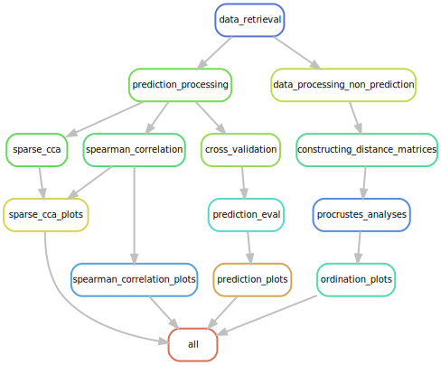

# Reproducible Analyses for manuscript "Healthy Infant Metabolomes are Robust to Normal Variations in Microbiome"

This repository hosts reproducible workflow for analyses represented in the manuscript "Healthy Infant Metabolomes are Robust to Normal Variations in Microbiome" by Nguyen et al. 2019. 

`snakemake` is utilized to produce a reproducible data analyses pipeline with easily visualizable rulegraph and modular pieces that can be cleanly modified. It also allows for automation of figure generation with appropriate data. Due to propriety of data, the file `data_directory.csv`is not shared and as such the first step of the pipeline can be skipped.  

The snakemake pipeline will generate the following folders:  
* `figures\`: Contain all figures of the paper.  
* `reports\`: Contain all Rmarkdown reports.  
* `analyses\`: Intermediary analyses results in `.rds` file.  
* `data\`: Data folder.  
* `temp\`: Intermediary non-analyses files such as alignment for trees.  

You can run these results using `snakemake` and the `Snakefile` with your own data. 
