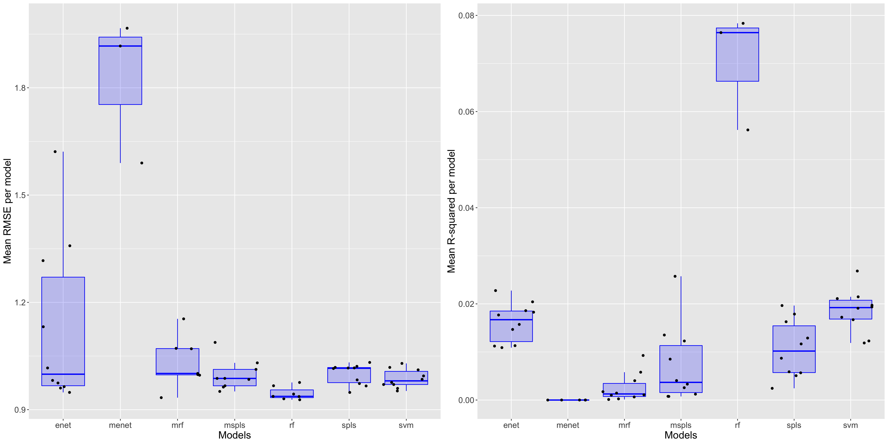

```{r setup, include=FALSE}
library(citr)
library(htmltools)
knitr::opts_chunk$set(echo = FALSE, warning = F, message = F, fig.align = "center")

```

## Filtering, Transformation and Normalization 
We normalize taxonomic data to proportions by dividing individual counts by sample-specific sequencing depths. All taxonomic profiles are aggregated up to Genus level with `phyloseq::tax_glom()`. We first imputed all 0 values with a unit pseudocount and then transform the data using center log-ratio transformation implemented in the function `clr` from the package `compositions` in `R`. For untargeted metabolomic data, we transform the data into relative abundances similar to our taxonomic profiles, and then subsequently use the arcsine square root transform to ensure approximate homoscedasticity when applying linear models. For targeted metabolomic data sets, since the data is already in exact concentration format, we simply perform a log (x + 1) transformation, accounting for 0 values. Models are fitted to the transformed data and the resulting predictions are back-transformed to preserve the coverage of predicted metabolite compositions.  

## Correlation analyses  
We perform exploratory overall correlation analyses between the two data sets. This is accomplished by comparing sample ordinations using Mantel and Procrustes tests. Both ordinations are non-metric multidimensional scalings (NMDS) of sample distance matrices performed using the function `metaMDS` from the package `vegan`.  
Using metabolite profiles, distance matrices were constructed by first performing a principal component analysis (PCA) on the metabolite abundances. Significant PCs selected using the Tracy-Widom test for eigenvalues [@frost2015] were then used as primary features of a new reduced metabolite matrix. Manhattan distance between samples were then constructed in the PC space. 
Using taxonomic profiles, distance matrices were constructed using relative proprotions (prior to pseudocount imputation and clr transformation) data. Generalized Unifrac Distance (Gunifrac) with parameter $\alpha = 0.5$ from the function `GUnifrac` from the `MiSPU` package was used to construct the distance matrix.  
Comparison between matrices were done using both Mantel and Procrustes test (implemented in the package `vegan`), however, previous studies have shown that Procrustes analyses are more robust [@jackson1995a].  
```{r, fig.cap = "**Figure 1.** NMDS ordination of samples according to taxonomy (blue) and metabolite (red) profiles for both targeted (left) and untargeted (right) methods in 12M samples. Metabolite ordinations were rotated according to the procrustes procedure to enable testing for concordance between datasets using permutations."}

```
For 12M samples we can see that only targeted metabolite profiles are significantly associated with taxonomic profiles according to the procrustes test(p = 0.001, SS = 0.9602, nperm = 999). However, Mantel tests shows that both metabolite profiles are significantly associated (Untargeted: p = 0.007, R = 0.09111; Targeted: p = 0.046, R = 0.06027)

```{r, fig.cap = "**Figure 2.** NMDS ordination of samples according to taxonomy (blue) and metabolite (red) profiles for both targeted (left) and untargeted (right) methods in 6W samples. Metabolite ordinations were rotated according to the procrustes procedure to enable testing for concordance between datasets using permutations."}

```
For 6W samples both types of profiling does not result in significant correlation with taxonomic abundances according to procrustes test. However, mantel tests again show that they are significantly correlated (Untargeted: p = 0.001, R = 0.1487; Targeted: p = 0.03, R = 0.1181).   

## Predictive model fitting and evaluation
We fit our machine learning models using the `caret` package in `R`. Scaling and centering was performed on the predictor matrix prior to model fitting. We evaluate our models using 10-fold nested cross validation, where within each outer training set we nest a cross-validation procedure for parameter tuning which should prevent overfitting.  
Models we compared include elastic net (EN), random forest (RF), support vector machines with radial basis function kernel (SVM), sparse partial least squares (SPLS) as well as multivariate extensions of EN, SPLS and RF. These models were chosen based on prelminiary fit, as well as from existing literature [@pasolli2016, @borchani2015].   
We evaluate our models using four different criterion: Spearman's rho, Root mean squared error (RMSE), Root relative squared error (RRSE) and Predictive R-squared (R2). In order to contextualize our values, we simulated null distributions of our test statistic by permuting both the predictor and outcome matrices using the function `randomizeMatrix` in the package `picante`. The procedure performs permutations while perserving the general structure of the dataset. So far, we've only performed null simulations for concentration-fitted data of certain metabolites.  

Figure 1 demonstrates the overall RMSE and R-squared scores averaged across metabolites for each model tested. Results show that Random Forest models are much better at prediction than all other models according to both metrics. Therefore, we choose to focus on random forest models as our main prediction tool.  

```{r, fig.cap="**Figure 3.** RMSE and R-squared scores averaged across folds then across all metabolites for each model. Models were trained and tested on data at 12M"}

```
Figure 2-5 demonstrates the performance of random forest models at each time point across both targeted and targeted NMR profiles. 
```{r, fig.cap="**Figure 4.** 10% Trimmed mean values across all cross validation folds of evaluation metrics for each targeted metabolite in the 6W dataset. Red lines indicate median values for that evaluation metric across 1000 null permutations"}

```

```{r, fig.cap="**Figure 5.** 10% Trimmed mean values across all cross validation folds of evaluation metrics for untargeted metabolite bins in the 6W dataset"}

```


```{r, fig.cap="**Figure 6.** 10% Trimmed mean values across all cross validation folds of evaluation metrics for each targeted metabolite in the 12M dataset. Red lines indicate median values for that evaluation metric across 1000 null permutations"}

```
```{r, fig.cap="**Figure 7.** 10% Trimmed mean values across all cross validation folds of evaluation metrics for untargeted metabolite bins in the 12M dataset. Red lines indicate median values for that evaluation metric across 1000 null permutations"}

```
Figure 6 shows a summary boxplots for all combinations. RMSE values were not included due to the difference in scale between RMSE and other evaluation metrics.  
```{r, fig.cap="**Figure 8.** Boxplots of each evaluation metric across all metabolites (averaged across all folds). RMSE values were not included due to difference in scale"}

```
We chose a cut off of $\rho = 0.3$ based on a recent study [@mallick2019] to identify well predicted metabolites. According to that criterion, for 12M samples, around 38.8% of targeted metabolites and 27.4% of untargeted metabolites fit while for 6W samples that number is 69.4% for targeted metabolites and 60% for untargeted metabolites. However when we look at the top performing metabolite for each condition, we have:  
```{r}
htmltools::includeHTML("./test1c5c7a574cb.html")
```
We can see that these values have high-correlation with the outcome, however the scale inaccurate from RMSE/RRSE/R-squared scores. As such, we can infer that our models can predict the trend of a number of metabolites within our metabolite set.  

## Additional graphics  
### Taxa and metabolite relative abundances   
```{r, fig.cap="**Figure 9.** Relative abundances of bacterial families (top panel) and targeted metabolites (bottom panel) for 6W samples"}

```

```{r, include=TRUE, fig.cap="**Figure 10.** Relative abundances of bacterial families (top panel) and targeted metabolites (bottom panel) for 12M samples"}

```

### Comparison of different distances  
```{r, fig.cap = "**Figure 11.** Sample distance according to metabolite profiles (both targeted (left) and untargeted (right)) vs according to taxonomic profiles at 6W. Gunifrac (alpha = 0.5) was used to construct sample distance matrix from taxonomic relative abundances while Manhattan distance was used to construct sample distance matrix from principal components of metabolite concentrations."}

```

```{r, fig.cap = "**Figure 12.** Sample distance according to metabolite profiles (both targeted (left) and untargeted (right)) vs according to taxonomic profiles at 12M. Gunifrac (alpha = 0.5) was used to construct sample distance matrix from taxonomic relative abundances while Manhattan distance was used to construct sample distance matrix from principal components of metabolite concentrations."}

```

## References  

